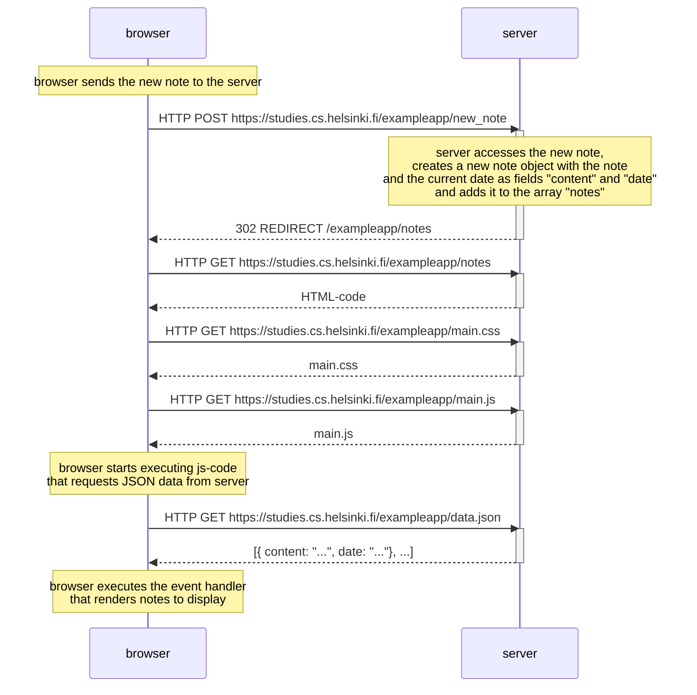

```mermaid
sequenceDiagram
	participant browser
	participant server
	Note over browser: browser sends the new note to the server
	browser ->> server: HTTP POST https://studies.cs.helsinki.fi/exampleapp/new_note
	activate server
	Note over server: server accesses the new note, <br />creates a new note object with the note <br />and the current date as fields "content" and "date" <br />and adds it to the array "notes"
	server -->> browser: 302 REDIRECT /exampleapp/notes
	deactivate server
	
	browser ->> server: HTTP GET https://studies.cs.helsinki.fi/exampleapp/notes
	activate server
	server -->> browser: HTML-code
	deactivate server
	
	browser ->> server: HTTP GET https://studies.cs.helsinki.fi/exampleapp/main.css
	activate server
	server -->> browser: main.css
	deactivate server
	
	browser ->> server: HTTP GET https://studies.cs.helsinki.fi/exampleapp/main.js
	activate server
	server -->> browser: main.js
	deactivate server
	
	Note over browser: browser starts executing js-code <br />that requests JSON data from server
	browser ->> server: HTTP GET https://studies.cs.helsinki.fi/exampleapp/data.json
	activate server
	server -->> browser: [{ content: "...", date: "..."}, ...]
	deactivate server
	Note over browser: browser executes the event handler <br />that renders notes to display
```

