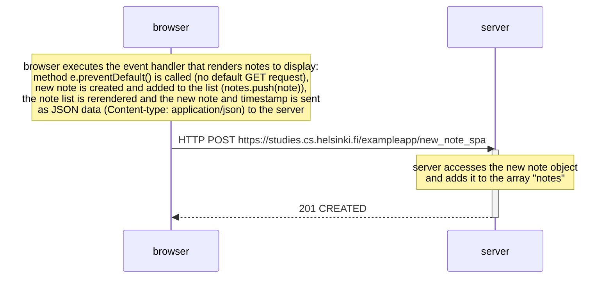

```mermaid
sequenceDiagram
	participant browser
	participant server
	Note over browser: browser executes the event handler that renders notes to display: <br />method e.preventDefault() is called (no default GET request), <br />new note is created and added to the list (notes.push(note)), <br />the note list is rerendered and the new note and timestamp is sent  <br />as JSON data (Content-type: application/json) to the server
    browser ->> server: HTTP POST https://studies.cs.helsinki.fi/exampleapp/new_note_spa
	activate server
	Note over server: server accesses the new note object <br />and adds it to the array "notes"
	server -->> browser: 201 CREATED
	deactivate server
	
```

